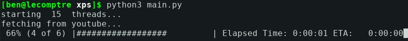

# YT Subscription Terminal
a youtube subscription rss feed fetch.
I don't wanna use youtube because im addicted and [ytfzf](https://github.com/pystardust/ytfzf) doesn't work for my 900 subscriptions




## Installation
```
pip install feedparser pyfzf progressbar progressbar2
```
## Dependecies
- [fzf](https://github.com/junegunn/fzf)
- [mpv](https://mpv.io/)
- [youtube-dl](https://github.com/ytdl-org/youtube-dl)
- python3.something

all must be available to the path

## Usage
```
python3 main.py
```
```
usage: main.py [-h] [--format FORMAT] [--load]

Fetch youtube subscription and watch videos

optional arguments:
  -h, --help            show this help message and exit
  --format FORMAT, -f FORMAT
                        look for specified format (default: 720)
  --load, -l            load from saved subscription videos (no fetching)
```
